# Corby Conservation Union
## Introduction
#### Project Description
Project is to campaign, convey and provide insight on what Corby Conservation Union do, hence portray the importance of conservation of nature (green and animal conservation).  
#### Project Purpose
The project is aimed at communicating with local, national and international audience the importance of conservation of our environment for future generation. This entails green and animal conservation, to reduce natural disaster experienced round the globe. Thus encourage every individual to play their part in any way they can.
The project provides several interactive features to enable users learn more about the organisation and easily navigate through the site to find desired content and support the organisation to continue conserving our ecosystem.
#### User Demographic
Initiative started from our local community Corby in Northamptonshire United  Kingdom, working with local communities, charities and community interest companies in and around Northamptonshire.  With a well thought after global initiative Corby Conservative Union is now engaging with other conservation entities around the globe. Other entities and individuals keen on  conservation of our planet natural resources and animals are encouraged to get involved through volunteering or material support for the organisations
## Design
#### Colour Scheme
The three main colours used are Granite Gray, Azure and Olive green. This is inline with the theme of this project "Go Green and animal conservation".
#### Topograhy
The Montserrat font is used  all through the website. Sans Serif is used as the backup font should for any reason the font isn't being imported into the site properly.
#### Imagery
The hero image is designed to aligned with the theme of the project showing outstanding green conservation surrounded by water and a house built with non-synthetic but  natural materials. Other images through the projects also focuses on green and animal  conservation.
## Features
The  core features/functionality of  this project is categorised as below. Future improvements are also highlighted in this section.
### Existing Features
#### Navbar
A responsive navigation header where all the links to other html pages are embedded. Burger icon is used to indicate  navbar in mobile screens and landscape. For media screen 786px and up (tablets) navigation to other pages are indicated at the header. 
```html
<header>
    <a href="index.html">
        <h1 id="logo">Corby Conservation Club</h1>
    </a>
    <input type="checkbox" name="nav-toggle" id="nav-toggle">
    <label for="nav-toggle" class="nav-toggle-label"><i class="fa-solid fa-bars-staggered"><i></label>
    <nav>
        <ul id="menu-card">
            <li><a href="index.html" class="active">Home</a></li>
            <li><a href="gallery.html">Gallery</a></li>
            <li><a href="register.html">Register</a></li>
            <li><a href="about-us.html">About Us</a></li>
            <li><a href="donate.html">Donate</a></li>
        </ul>
    </nav>
</header>
```
. 
#### Footer and Social Network Icons
A responsive footer is included for user interaction and where they can follow Corby Conservation Union social network. A home page for Facebook, Instagram, Twitter(X) and YouTube is embedded through the social media icons.
```html
<footer>
    <h2 id="networks">Follow us</h2>
    <ul id="network-with-us">
        <li><a href="https://www.facebook.com/" target="_blank" rel="noopener" aria-label="Visit us on facebook (open in a new tab"><i class="fa-brands fa-facebook"></i></a></li>
        <li><a href="https://x.com/" target="_blank" rel="noopener"
                    aria-label="Visit us on X (open in a new tab)"><i class="fa-brands fa-x-twitter"></i></a></li>
        <li><a href="https://www.instagram.com/" target="_blank" rel="noopener"
                    aria-label="Visit us on instagram (open in a new tab)"><i class="fa-brands fa-square-instagram"></i></a></li>
        <li><a href="https://www.youtube.com/" target="_blank" rel="noopener"
                    aria-label="Visit us on youtube (open in a new tab)"><i class="fa-brands fa-youtube"></i></a></li>
        <li><a href="https://www.linkedin.com/" target="_blank" rel="noopener"
                    aria-label="Visit us on linkedin (open in a new tab)"><i class="fa-brands fa-linkedin"></i></a></li>
    </ul>
</footer>
```

#### Buttons and Links
Responsive button and links were used. “Get Involved” button in registration page is linked to https://formdump.codeinstitute.net. “Donate” button on donate page is linked to thank-you.html. The icons buttons to social media are all linked to home page of respective social network.
```html
<div>
    <button type="submit" class="donate-button">Donate</button>
</div>
```
```html
<div>
    <button type="submit" class="join-button">Get Involved!</button>
</div>
```
. .
#### Image Gallery
Image Gallery is a page dedicated to green and animal conservation images compiled with Masonry redesign style with column counts for different screen sizes. "alt" attribute included to describe the images and enable screen reader to read out the description of the image for visually impaired users.
```html
<section id="gallery">
    <h2 class="hidden-heading">Gallery</h2>
    <div id="pictures">
        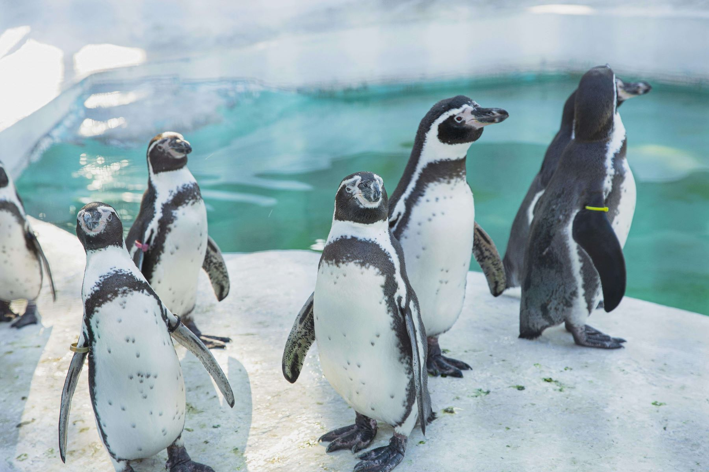
        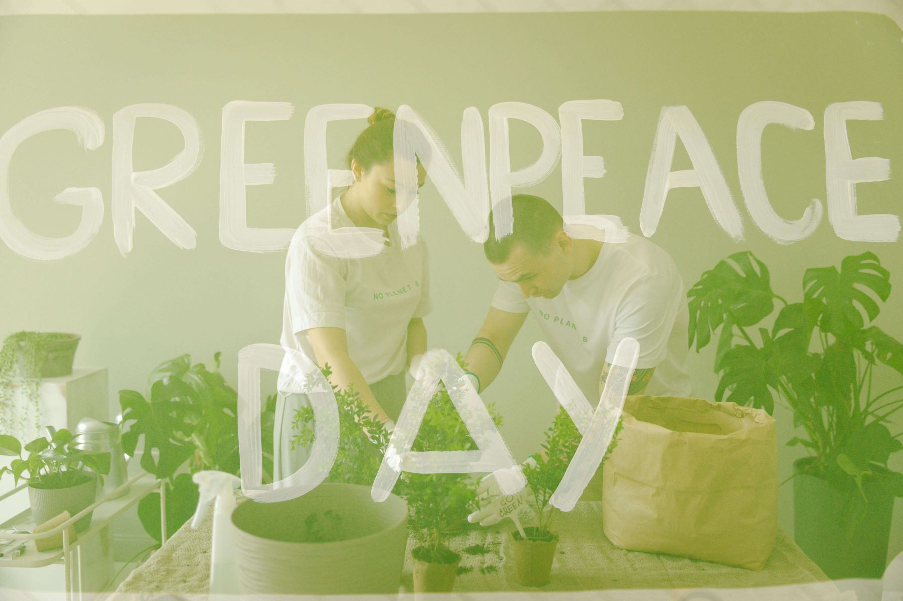
        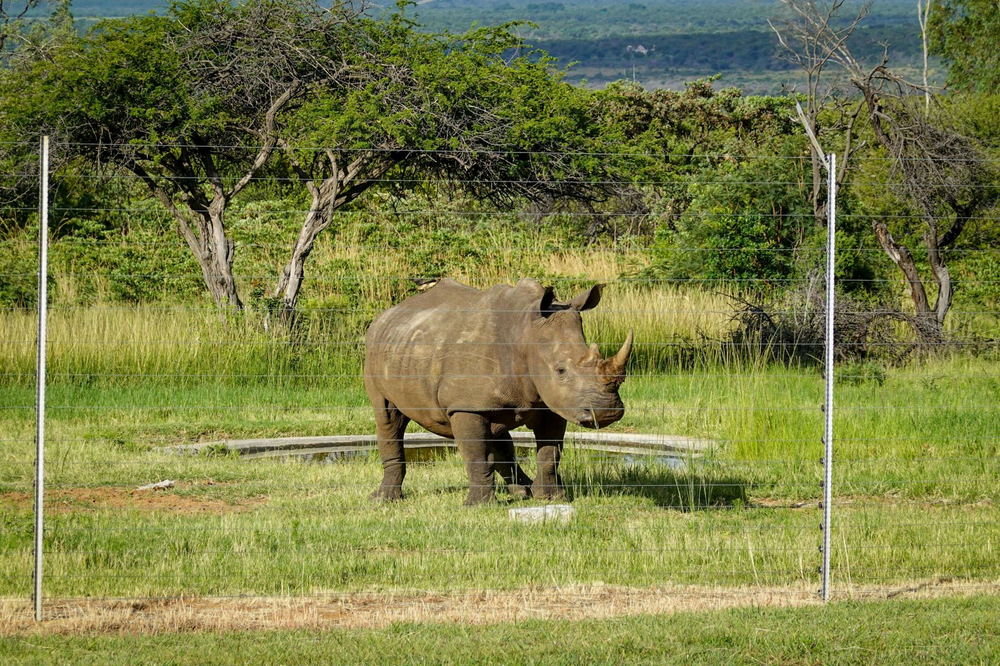
        
        
        
        
        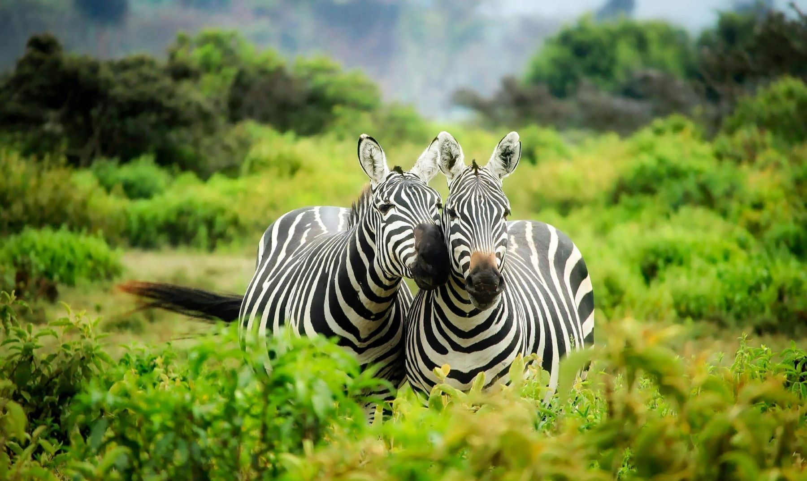
        
        
        
    </div>
</section
```
.
#### Register Form
Responsive registration form created to accept First name, Last Name, Email address and radio button to select label options. It is expected that any none text input on email address, first and last name will through up an error message. Users are also restricted to select only one label. 
```html
<form id="registration-form" action="https://formdump.codeinstitute.net" method="POST">
    <h2>Register with us!<i class="fa-solid fa-handshake"></i></h2>
    <br>
    <label for="first-name">First Name</label>
    <input type="text" name="first_name" id="first-name" class="text-input" autocomplete="on" required>
    <br>
    <label for="last-name">Last Name</label>
    <input type="text" name="last_name" id="last-name" class="text-input" required>
    <br>
    <label for="email-address">Email Address</label>
    <input type="email" name="email_address" id="email-address" class="text-input" required>
    <div class="radio-buttons">
        <div>
            <label for="wildlife">Wildlife</label>
            <input type="radio" name="conservation_preference" id="wildlife" value="wildlife" required checked>
        </div>
        <div>
            <label for="go-green">Go Green</label>
            <input type="radio" name="conservation_preference" id="go-green" value="go-green" required>
        </div>
        <div>
            <label for="both">Both</label>
            <input type="radio" name="conservation_preference" id="both" value="both" required>
        </div>
    </div>
    <div>
        <button type="submit" class="join-button">Get Involved!</button>
    </div>
</form>
```
.
#### Donate Form
Responsive donate form designed to accept Name on Card, 16 digits card number , card expiry date, 3 digits CVC card number and amount. This section is design for alpha numeric input, however  specific conditions must be met before the form can submit. Name on Card must be alpha, card number must be numeric and can’t input more than 16 digits. Expiry date must be a future date, CVC must be numeric and can’t exceed 3 digits and amount must be numeric.
```html
<div id="donate">
    <form id="donation-form" action="thank-you.html" method="GET">
        <h2>Support Us<i class="fa-solid fa-circle-dollar-to-slot"></i></h2>
        <br>
        <h3 class="phrase">"It's not too late to Go Green and save wildlife, but we must act together".</h3>
        <br>
        <div>
            <label for="name-on-card">Name on Card</label>
            <input type="text" name="name_on_card" id="name-on-card" class="text-input" required>
        </div>
        <div>
            <label for="card-number">Card Number</label>
            <input type="text" inputmode="numeric" pattern="[0-9\s]{13,16}" autocomplete="cc-number"
                    name="card_number" id="card-number" class="number-input" placeholder="xxxx xxxx xxxx xxxx"
                    maxlength="16" required>
        </div>
        <br>
        <div>
            <label for="expiry-date">Expiry Date</label>
            <input type="date" name="expiry_date" id="expiry-date" class="date-input" value="2024-08-09"
                   required>
        </div>
        <br>
        <div>
            <label for="cvc">CVC</label>
            <input type="text" inputmode="numeric" pattern="[0-9]{3}" autocomplete="cc-number"
                   name="cvc_number" id="cvc" class="number-input" maxlength="3" placeholder="xxx" required>
        </div>
        <br>
        <div>
            <label for="amount">Amount</label>
            <input type="number" name="amount_number" id="amount" class="number-input" value="0.00"
                    required>
        </div>
        <div>
            <button type="submit" class="donate-button">Donate</button>
            </div>
     </form>
</div>
```

#### Improvement Features
* Donate button can be linked to banks via financial services network like visa, master card etc.
* Videos, iframe or pictures functionalities that illustrates green and wildlife conservation  can be added to gallery.html file
* News feed can be added to present news specifically targeted to green and wildlife conservation, including any announcement from Corby Conservation Union.
*
## Manual Testing
### Features Testing
|Key Features|   User Value   |Functionality Test|Outcome|
|:------------|:----------------|:-------------|:------------|
|Logo|Assist user navigate through the website as it renders the **Home page** when logo is clicked.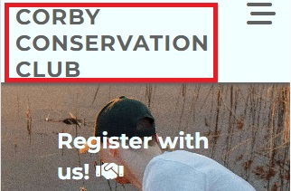|While on any other page (Register, Donate, About Us) click on **logo**.|While on donate page, logo was clicked and home page was rendered. Facilitates users experience  should they want to know more of our services before donating to Corby Conservation Union. |
|Navbar-Home Page|User meaningful value, render **Home pag** when navbar is clicked. 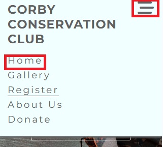|From any page on mobile screen click the nav toggle, select **Home** to render. On a tablet or higher directly select Home.|While on register page or any other page, click nav toggle burger sign, click home to render page. |
|Navbar-Gallery  |User experience value, render **Gallery page** when navbar is clicked. 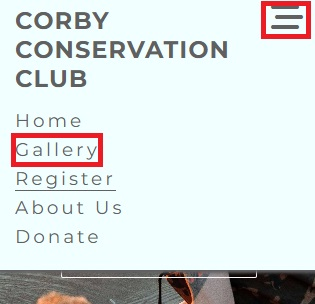|From any page on mobile screen click the nav toggle, select **Gallery** to render. On a tablet or higher directly select Gallery|While on home  page or any other page, click nav toggle burger sign, click gallery  to render page. Enable user to quickly view gallery and review images based on our activities and events. |
|Navbar-Register |Renders **Register page** when navbar is clicked. 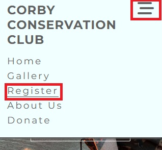 |From any page on mobile screen click the nav toggle, select **Register** to render. On a tablet or higher directly select Register.|While on gallery  page or any other page, click nav toggle burger sign, click Register  to render page. Users to seamlessly visit our Register page to join us. 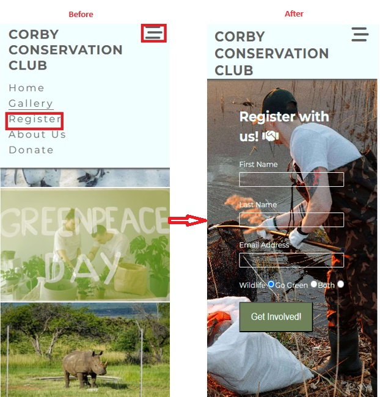|
|Navbar-About Us|User experience value, Renders **About Us page** when navbar is clicked. 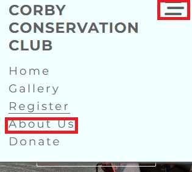|From any page on mobile screen click the nav toggle, select **About Us**  to render. On a tablet or higher directly select About Us.|While on register  page or any other page, click nav toggle burger sign, click About Us  to render page. Users to effortlessly visit About Us page to understand who we are. 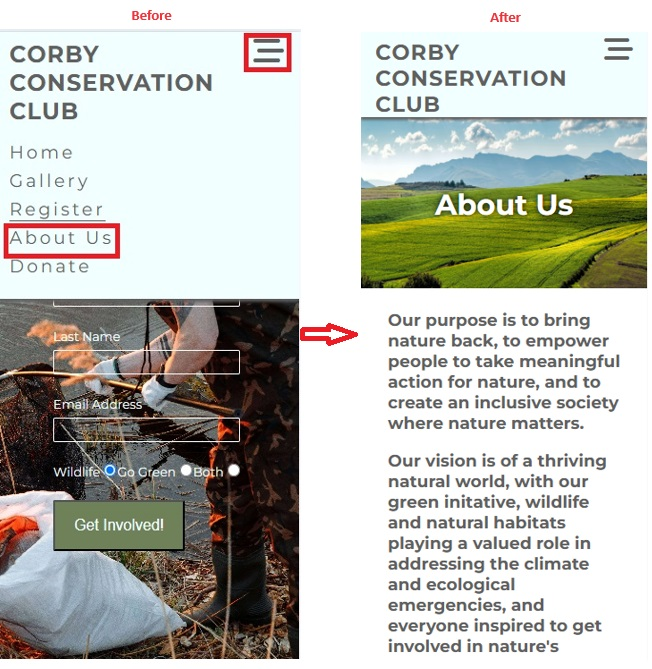|
|Navbar-Donate|Assist user navigate through the website as it renders the **Donate page** when logo is clicked. 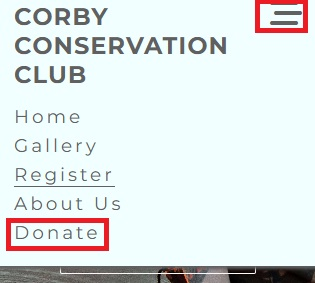|From any page on mobile screen click the nav toggle, select **Donate**  to render. On a tablet or higher directly select Donate|While on about us  page or any other page, click nav toggle burger sign, click Donate  to render page. Users to effortlessly visit Donate page to support our cause. |
|Footer-Social Network Icons|Enhances user experience to follow and communicate with **Corby Conservation Union**, hence news updates and conservation  awareness. |From any page in all media screen sizes click on any social network icon **(Facebook, Instagram, X, YouTube and LinkedIn)**. The page will open in new tab.|Social network icons are currently  linked to home page of respective  media . Facilitate users to follow us on  social network and positively impact green and wildlife conservation in any way they can.  Pages opens in a new tab. Links currently points to  login page of social networks included. 
|Register Form|Specific user need is to become a member by registering with Corby Conservation Union. The main details required on the form is First and Last name, email address and conservation preference. Which is then submitted. 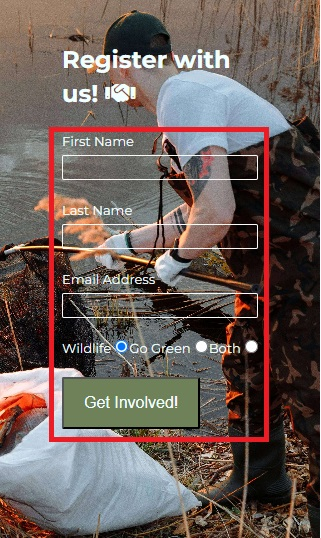|On **Register page** in all screen sizes fill in the form with First and last name, with email address. All fields must be completed with the correct details and conservation preference selected before submitting the form through **Get Involved** button.|When form is completed as correctly expected output is as follows: When form is not completed correctly e.g. incomplete or no **email address**, error message is displayed.When **name** field is empty and error is displayed. 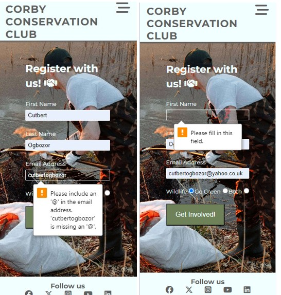|
|Donate Form|To support Corby Conservation Union, users will use donate form to provide banking details and amount they wish to donate. 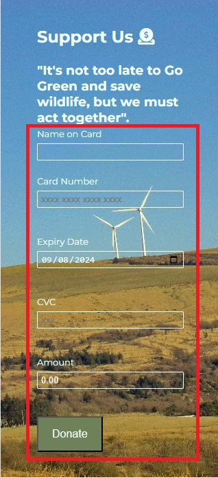|On Donate page in all screen sizes fill in the form with  name on card, card number maximum of 16 digits, card expiry date, CVC card number maximum of 3 digits and amount user wish to donate. The card and CVC number inputs are alphanumeric, however form will not submit if populated with letters. Users are unable to input more than 16 digits for card number and 3 digits for CVC number. Amount input is restricted to numeric input. All conditions must be met before form can submit. Donate button is linked to a **Thank you page**|When all inputs are completed as expected output links to a **Thank you page**.When form is not completed correctly e.g. alpha input on card or CVC number, empty input fields. The **error messages** are shown as below and form will not submit. |

### Features Test Result Compilation
|Key Features|   Test Case  |Outcome|
|:------------|:----------------|:-------------|
|Logo|Click on the logo|User is taken to **Home page** |
|Navbar-Home page|For mobile media screen click on nav toggle on each page then select Home page. For tablets and higher click directly on Home link on each page|User is taken to **Home page**|
|Navbar-Gallery|For mobile media screen click on nav toggle on each page then select Gallery. For tablets and higher click directly on Gallery link on each page.|User is taken to **Gallery page**|
|Navbar-Register|For mobile media screen click on nav toggle on each page then select Register. For tablets and higher click directly on Registry link on each page.|User is taken to **Register page**|
|Navbar-About Us|For mobile media screen click on nav toggle on each page then select About Us. For tablets and higher click directly on About Us link on each page.|User is taken to **About Us page**|
|Navbar-Donate|For mobile media screen click on nav toggle on each page then select Donate. For tablets and higher click directly on Donate link on each page.|User is taken to **Donate page**|
|Footer-Social Network Icons|On the footer click each social network icon on each page.|User is taken to each social network home page **(opens in a new tab)**|
|Register Form|On Register page submit partially filled form and empty form respectively|Error signalling required input fields |
|Donate Form|On Donate page submit partially filled form and empty form respectively|Error signalling required input fields |

### Lighthouse Performance
|View Tested|   Outcome of the audit  |Soulution Applied|Screenshot of clear Validator output|
|:------------|:----------------|:-------------|:------------|
|Mobile||Reseized background images for home page (hero-image, donation-page, and register page) to reduce size styled CSS to fit. Removed dormant CSS  declarations.||
|Desktop||Reseized background images for home page (hero-image, donation-page, and register page) to reduce size styled CSS to fit. Re moved dormant CSS  declarations.||

### Validation Testing
|Page Tested|Screenshot of Errors and Warnings   |Solution Applied|Screenshot of clear Validation Output|
|:------------|:----------------|:-------------|:------------|
|Index.html|   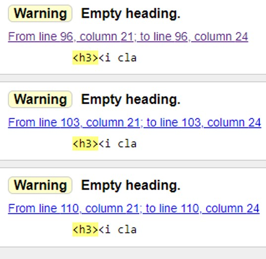| **1**. Comment out section attribute from section end tag and moved attribute to opening tag.<br> **2** Add closing tag on section element <br> **3**. Comment out the open p element nested in main element.<br>**4**. Comment out h3 elements in event section and replaced with p element to nest the favicons|
|Gallery.html|  No Error or Warning|Not Applicable |
|Register.html|No Error or Warning|Not Applicable|
|Aboutus.html|No Error or Warning|Not Applicable |
|Donate.html| **No Error**, two Warnings | None, as these are warnings|
|Thank-you.html|No Error or Warning|Not Applicable||
|Style.css|No Error|Not Applicable||

### Browser compatibility
|Browser Tested|Functionality Tested|Visual Consistency|Outcome|
|:------------:|:----------------:|:-------------:|:-------------:|
||Navigation, Forms, Links and Buttons|Layout, design, content display consistency|Intended appearnce and responsiveness is good|
||Navigation, Forms, Links and Buttons|Layout, design, content display consistency|Intended appearnce and responsiveness is good|
||Navigation, Forms, Links and Buttons|Layout, design, content display consistency|Intended appearnce and responsiveness is good|
#### Browser compatibility Test Result
|Browser Tested|Intended Appearance|Intended Responsiveness|
|:------------:|:----------------:|:-------------:|
||Good|Good|
||Good|Good|
||Godd|Good|

### Screen sizes Responsiveness  

|Device Tested|Site responsive >=700px |Site responsive <699px|Render as expected|
|:------------:|:----------------:|:-------------:|:--------------:|
|iPhone 12 Pro (Mobile)|N/A|Good|Good 390px X 844px |  
|iPad Mini (Tablet)|Good|N/A|Good 768px X 1024px |
|iPad Air (Laptop)|Good|N/A|Good 820px X 1180px |
|Nest Hub Max (Desktop)|Good|N/A|Good 1280px X 800px |

### Pages Responsivnes
|Home Page|Register Page|Gallery Page|About Us Page|Donation Page|Thank you Page|
|:------------:|:----------------:|:-------------:|:--------------:|:--------:|:------:|
|||||||

### Accessibility
|Color Contrats Testing|Alternative Text for Images |Outcome|
|:------------|:------------------|:---------------:|
|Home Page|Alternative text used throughout the page for images|No Contrast error. 1 empty label error. Unable to fix as nav-toggle label is a burger favicon. One alert for redundant link, this is for href= index-html. The error and alert is on the header hence runs throughout the other pages. 
|Gallery Page|Alternative text used throughout the page for images|No Contrast error. 1 empty label error- Unable to fix as nav-toggle label is a burger favicon. One alert for redundant link, this is for href= index-html. The error and alert is on the header hence runs throughout the other pages. 
|Register Page|Alternative text used throughout the page for images|No Contrast error. 1 empty label error- Unable to fix as nav-toggle label is a burger favicon. 1 alert for redundant link, this is for href= index-html. The error and alert is on the header hence runs throughout the other pages. 8 contrast error due to label names and text input border azure color. This was updated to white and retested but no improvemnt on contrast error. 
|About Us Page|Alternative text used throughout the page for images|1 Contrast error. 1 empty label error- Unable to fix as nav-toggle label is a burger favicon. 2 alerts for redundant link and a heading level skipped, this is for href= index-html. The error and alert ar on the header hence runs throughout the other pages. Updated the "About Us" color from white to black to improve contrast. Updted "purpose" div from h3 to h2 and reduced the font-size. Corrected result: | 
|Donate Page|Alternative text used throughout the page for images |9 Contrast error. 1 empty label error- Unable to fix as nav-toggle label is a burger favicon. 1 alerts for redundant link, this is for href= index-html. The error and alert is on the header hence runs throughout the other pages. Donate-button background color  updated from olive green to black and all input text color updated from azure to white to improve contrast.|
|Thank-You page|Alternative text used for image|1 Contrast error. 1 empty label error- Unable to fix as nav-toggle label is a burger favicon. 1 alert for redundant link, this is for href= index-html. The error and alert is on the header hence runs throughout the other pages. |
|
## Technologies Used
### Languages Used
[HTML5](https://en.wikipedia.org/wiki/HTML5)  
[CSS](https://en.wikipedia.org/wiki/CSS)  
## Bugs
#### Bugs Resolved
|Bug|   Description |Solution Applied|Result|
|:------------|:----------------|:-------------|:------------|
|#register background image styling|#register id was styled with height: 850px and media query 768px and up background position :centre;  but the image was cutting off when the screen size increases to 1291px. |Image resized  and height updated to 100vh, media query 768px and up, background position updated to top.|Bug resolved: |
|#donation-from, maximum character for card and CVC number|Card and CVC field were taken more that 16  and 3 characters respectively. |Updated input type to text, declared  inputmode=numneric, maxlenght=16 and 3 respectively.||
|#donation styling not pushing down to the footer|Position declaration caused a gap between #donation and footer element. |Comment out  position: fixed; and declared height:100vh; in stylesheet||
|Gallery page load slowly|Gallery loading speed was very slow, hence page load slowly, even with compressed images|Resized the images|Loading a lot faster|

#### Bugs Unresolved
|Bug|   Description |Solution Applied|Result|
|:------------|:----------------|:-------------|:------------|
|Thank you page, background image zoom out on large screen sizes|Background image  zooms out as the screen size increases, hence bottom of image not visible enough on large screen.  |Added media query styling for 570px and up. Resized and compressed the image. Prospective solution: Change background to an image that has space at the bottom with none important imagery details|Unresolved.|

### Libraries
* [Google Fonts](https://fonts.google.com/) fonts were used to import the “Montserrat and Lato” font into the style.css file which is used on all pages throughout the project.  
* [GitHub](https://github.com/)  is used to store the projects code after being pushed from [Gitpod](https://codeinstitute-ide.net/new) were the work station is created.
* [Font Awesom](https://fontawesome.com/search?q=charity&o=r&m=free) was used on all pages throughout the website to add icons for aesthetic and user experience  purposes.  
* Windows photo editor was used to resize images
## Deployment
The project was deployed to GitHub Pages using the following steps..
1.	Log in to GitHub and locate [my repository](<https://github.com/Cutbert1/Corby-Conservation-Club> ) 
2.	At the top of the Repository (not top of page), locate the **Settings** Button on the menu.
3.	Scroll down the Settings until you locate the **Pages**, then click.
4.	In the **Build and Deployment**, select **main branch** and ensure the folder is set to **root folder** and click **save**
5.	Return to code tab of GitHub repo. Delay for few minutes to enable the build finish, then refresh  the page. 
6.	Check deployment section on the code page (right hand side bar)
7.	Click **github-pages** to see the live URL
## Credits
### Codes
Code Institute [Love Running Project](https://github.com/Code-Institute-Solutions/love-running-v3/tree/main/6.1-lets-add-some-images)
### Tutorials
* Code Institute HTML | CSS Programme 
* Tutor Support  
* Mentor  
* Code Institute Slack Community 
* [stackoverflow](https://stackoverflow.com/questions/23739224/empty-heading-warning-on-html5-validation)
### Photos
* [pixel.com](https://www.pexels.com/)
### Text Content
* [Wildlife Trust](https://www.wildlifetrusts.org/get-involved/membership)
