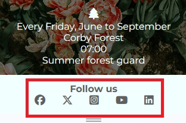

# Corby Conservation Union
## Introduction
#### Project Description
Project is to campaign, convey and provide insight on what Corby Conservation Union do, hence portray the importance of conservation of nature (green and animal conservation).
#### Project Purpose
The project is aimed at communicating with local, national and international audience the importance of conservation of our environment for future generation. This entails green and animal conservation, to reduce natural disaster experienced round the globe. Thus encourage every individual to play their part in any way they can.
The project provides several interactive features to enable users learn more about the organisation and easily navigate through the site to find desired content and support the organisation to continue conserving our ecosystem.
#### User Demographic
Initiative started from our local community Corby in Northamptonshire United  Kingdom, working with local communities, charities and community interest companies in and around Northamptonshire.  With a well thought after global initiative Corby Conservative Union is now engaging with other conservation entities around the globe. Other entities and individuals keen on  conservation of our planet natural resources and animals are encouraged to get involved through volunteering or material support for the organisations
## Design
#### Colour Scheme
The three main colours used are Granite Gray, Azure and Olive green. This is inline with the theme of this project "Go Green and animal conservation".
#### Topograhy
The Montserrat font is used  all through the website. Sans Serif is used as the backup font should for any reason the font isn't being imported into the site properly.
#### Imagery
The hero image is designed to aligned with the theme of the project showing outstanding green conservation surrounded by water and a house built with non-synthetic but  natural materials. Other images through the projects also focuses on green and animal  conservation.
## Features
The  core features/functionality of  this project is categorised as below. Features left unimplemented are also highlighted in this section.
### Existing Features
#### Navbar
A responsive navigation header where all the links to other html pages are embedded. Burger icon is used to indicate  navbar in mobile screens and landscape. For media screen 786px and up (tablets) navigation to other pages are indicated at the header.  . 
#### Footer and Social Media Icons
A responsive footer is included for user interaction and where they can follow Corby Progressive Union social network. A home page for Facebook, Instagram, Twitter(X) and YouTube is embedded through the social media icons. . 
#### Buttons and Links
Responsive button and links were used. “Get Involved” button in registration page is linked to https://formdump.codeinstitute.net. “Donate” button on donate page is linked to thank-you.html. The icons buttons to social media are all linked to home page of respective social media. . . . .
#### Image Gallery
Image Gallery is a page dedicated to green and animal conservation images compiled with Masonry redesign style with column counts for different screen sizes. "alt" attribute included to describe the images and enable screen reader to read out the description of the image for visually impaired users. . .
#### Register Form
Responsive registration form created to accept First name, Last Name, Email address and radio button to select label options. It is expected that any none text input on email address, first and last name will through up an error message. Users are also restricted to select only one label. . .
#### Donate Form
Responsive donate form designed to accept Name on Card, 16 digits card number , card expiry date, 3 digits CVC card number and amount. This section is design for alpha numeric input, however  specific conditions must be met before the form can submit. Name on Card must be alpha, card number must be numeric and can’t input more than 16 digits. Expiry date must be a future date, CVC must be numeric and can’t exceed 3 digits and amount must be numeric. . 
#### Features Left to Implement
## Manual Testing
### Quality Assurance
### User Experience Assurance
### Features Testing
#### Lighthouse Perfomance
#### Validation Testing
#### Browser compatibility
#### Screen sizes Responsiveness
#### Accessibility
#### Bugs Resolved
#### Bugs Unresolved
## Deployment
## Credits
### Codes
### Tutorials
### Photos
### Text Content